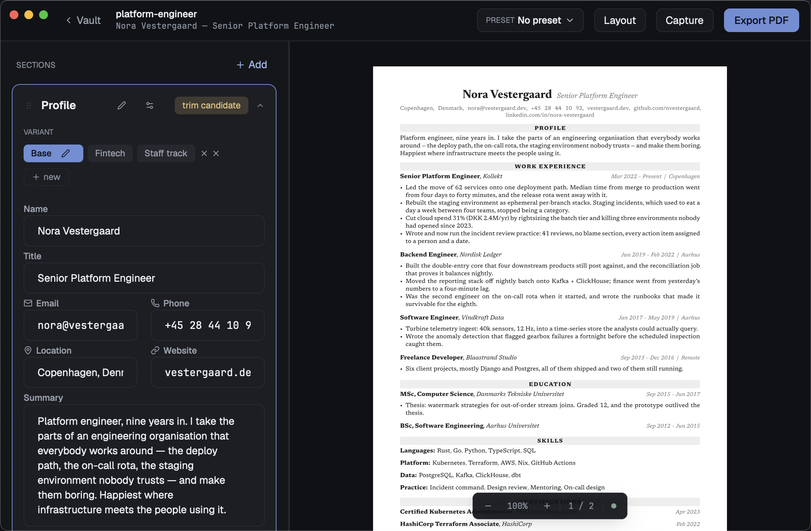
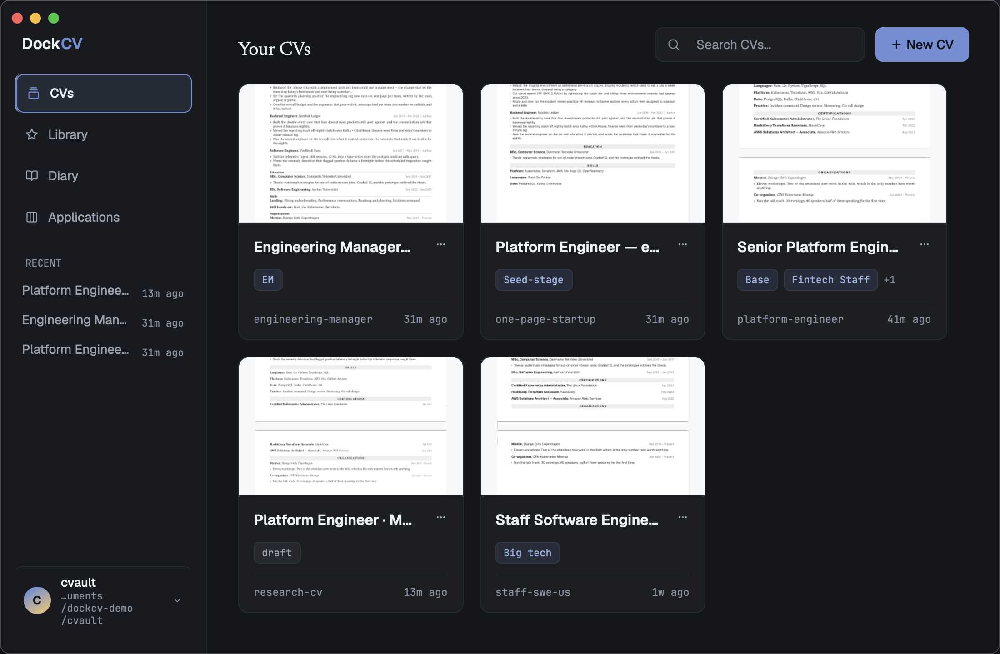
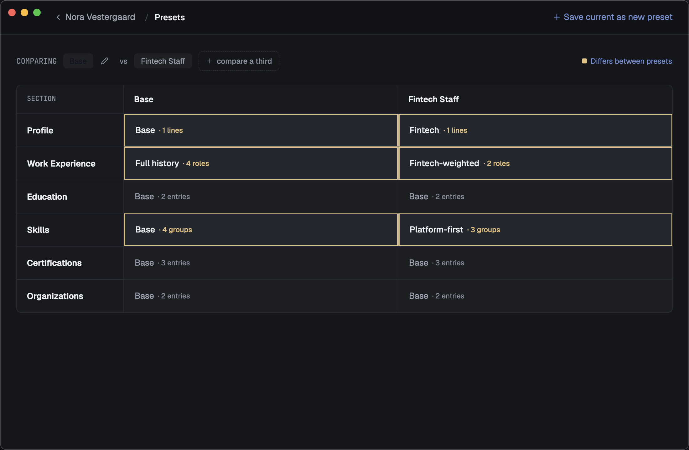
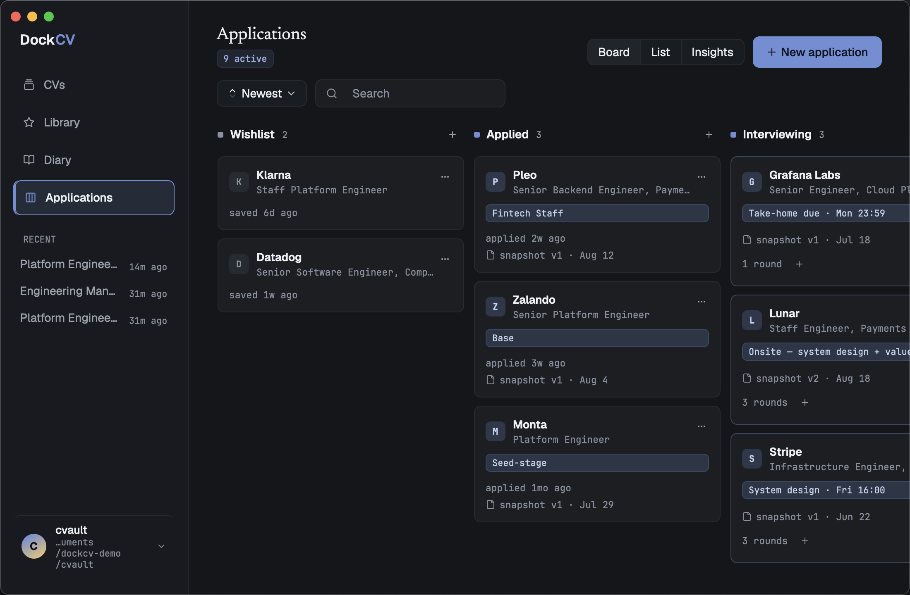

# DockCV

A résumé workbench that runs on your machine and keeps your work in files you
own. No account, no cloud, no browser pretending to be an application.

If you apply for jobs seriously, you do not have one CV. You have a version for
infrastructure roles and a shorter one for startups, a paragraph you rewrote
four times for a company that never replied, and a folder called `cv_final_v3`
that everyone recognises and nobody enjoys. DockCV is built for that reality
rather than against it: one document, several variants of every section, and a
typesetter underneath that renders the page as you type.

[dockcv.zeelex.me](https://dockcv.zeelex.me) · [Downloads](https://github.com/iamzeelex/dockcv/releases)

<!--
  SCREENSHOTS — add the files, then delete this comment and uncomment below.
  Four are enough, in the order below: the editor with its live preview
  first, since that is the thing to see; then the gallery, the preset
  matrix and the applications board. 1600px wide, dark palette, and a
  vault with real-looking content rather than Lorem ipsum.

  
  
  
  
-->

## What it does

**The page is real while you write it.** DockCV embeds the
[Typst](https://typst.app) compiler, so the preview beside the editor is the
document, laid out for the paper size you chose, not an approximation of it.
Change the leading and you watch the last line climb back onto page one. Margins,
text scale, page size and the typeface are settings of the document, and they
are saved with it.

**A section can have several versions, and a preset picks between them.** Your
work history in full, and the same history cut to four roles. A summary aimed at
platform teams, another at product. A preset is nothing but a set of those
choices with a name on it, so switching from `FAANG · concise` to `Startup ·
long` is one menu away and changes nothing you would have to undo.

**A block library, with an honest answer about what reuse means.** Star a job, a
skill group or a certificate and it joins a pool you can drop into any CV. Every
card tells you where it already is — and when you edit one that three CVs hold a
copy of, DockCV names all three, marks the ones that reworded it for themselves,
and asks which should take the change. Copies stay copies unless you say
otherwise.

**A diary that survives the year.** The reason a CV is painful in March is that
the work happened in June and nobody wrote it down. Paste a status report, a
retro, a self-review draft, and DockCV splits it into candidate entries you
accept, edit or throw away one by one. Entries you mark confidential never reach
a bullet verbatim. Later, a win becomes a line in a specific CV, under a specific
job, in a specific variant — and the entry remembers where it went.

**Applications you can be honest about afterwards.** Cards move from wishlist to
applied to interviewing to closed. The moment one is sent, the app compiles the
pinned CV and stores the actual PDF, so a card opened in November shows what the
company read in July rather than whatever the document has become since. The
funnel is drawn from those movements, which means it can tell you which preset
gets answered and which one dies quietly.

## Your files

A vault is an ordinary folder. One [TOML](https://toml.io) file per CV, plus
`library.toml`, `diary.toml` and `applications.toml`, all of them plain text you
can read without this app and edit in any editor. Put the folder in iCloud or
Dropbox, keep it in git, copy it to a stick — DockCV has no opinion, because it
never holds your work anywhere else. Saves are automatic and debounced; the path
is always visible in Settings and one click from Finder.

Nothing leaves your computer. There is no telemetry, no account, no sync service
and no analytics, and every font and the typesetting package are compiled into
the binary, so a machine with the network switched off behaves exactly like one
without. The single request the app can make is an update check, which is off
until you turn it on; it looks up a version number, sends nothing about you, and
never downloads or installs anything on its own. When a new version exists you
get one line in the sidebar and a link to the download page.

## Getting it

Builds are on the [releases page](https://github.com/iamzeelex/dockcv/releases).

**macOS** — download the `.dmg`, drag DockCV to Applications. Apple Silicon
only. The build is not notarised, because notarisation requires a paid developer
account, so the first launch needs one extra step: double-click, let macOS refuse,
then open **System Settings ▸ Privacy & Security**, scroll to Security, and press
*Open Anyway*. You will never see it again. `HOW-TO-OPEN.txt` ships beside the
disk image and says the same thing.

**Linux and Windows** — the archives contain a binary that builds and starts, and
that is as much as anyone can currently promise: neither platform is tested. If
you run one of them and something is wrong, an issue with the log attached is
genuinely useful.

Prefer to build it yourself? [CONTRIBUTING.md](CONTRIBUTING.md) has the
toolchain and the commands.

## Where it is

Version 0.2.0. The core is finished and in daily use: import, the editor and its
live preview, layout controls, presets, the library, the diary, applications with
PDF snapshots, PDF export, undo, dark and light palettes.

Missing, and worth knowing before you commit a job hunt to it: there is no
version history beyond undo, no DOCX or plain-text export, no cover letters, and
no AI of any kind. The last one is deliberate rather than pending — when it does
arrive it will retrieve from your own diary and library and propose edits you
accept word by word, never invent a number you did not write down.

Importing an existing CV works from PDF, DOCX, a LinkedIn data export, JSON
Resume or Markdown. A PDF that is a scan of a page has no text to read, and DockCV
says so plainly instead of producing an empty document.

## When something breaks

The app keeps a log at `~/Library/Logs/DockCV/dockcv.log`, reachable from
**Settings ▸ Storage** or the Help menu. It records what the app did and never
what you wrote: no CV text, no diary entries, and your home folder is written as
`~` rather than by your account name. Attach it to an
[issue](https://github.com/iamzeelex/dockcv/issues) and the answer usually falls
out of it.

## Licence

Dual-licensed under [MIT](LICENSE-MIT) or [Apache-2.0](LICENSE-APACHE), at your
option. DockCV embeds fonts, an icon set and a Typst package under their own
terms; those notices are collected in
[THIRD-PARTY-NOTICES.md](THIRD-PARTY-NOTICES.md) and travel with every build.
